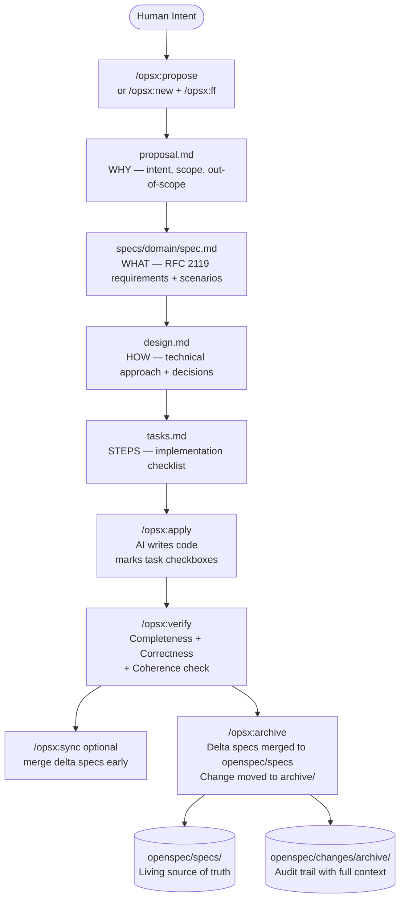
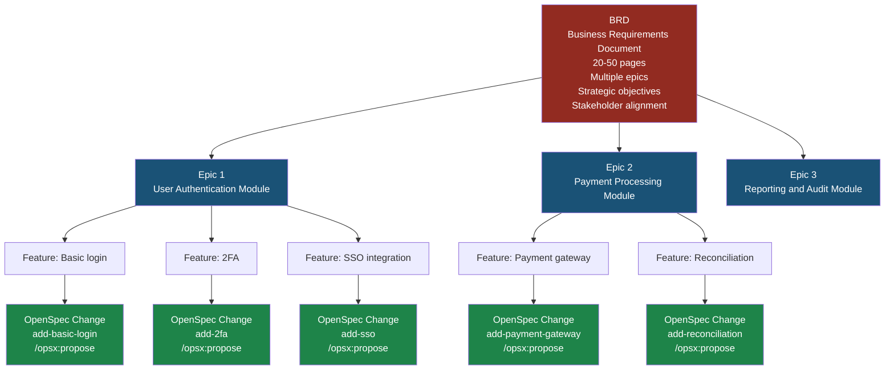
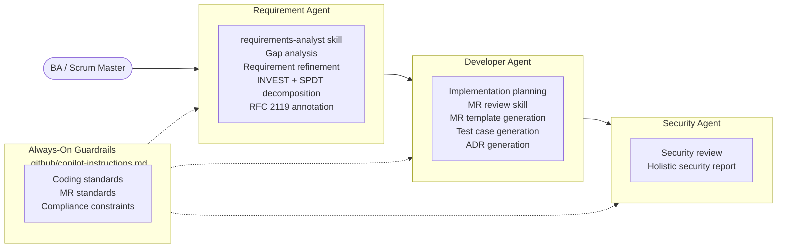
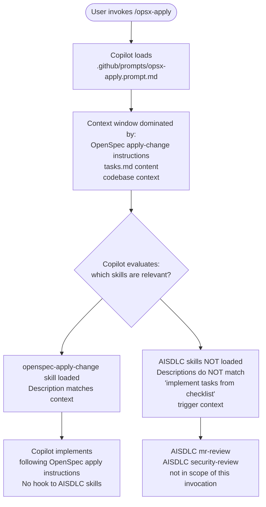
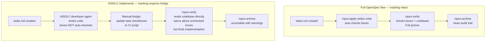
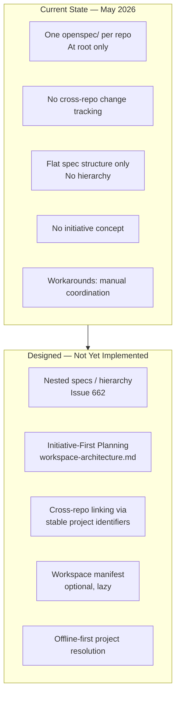
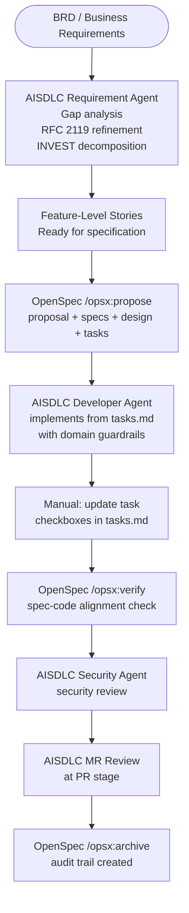
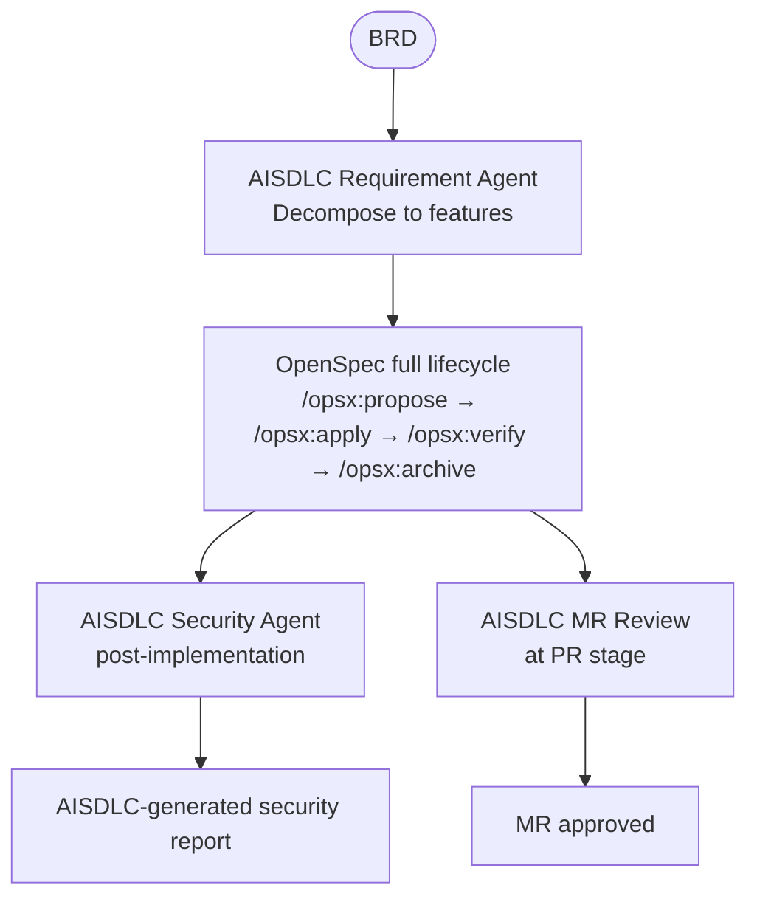
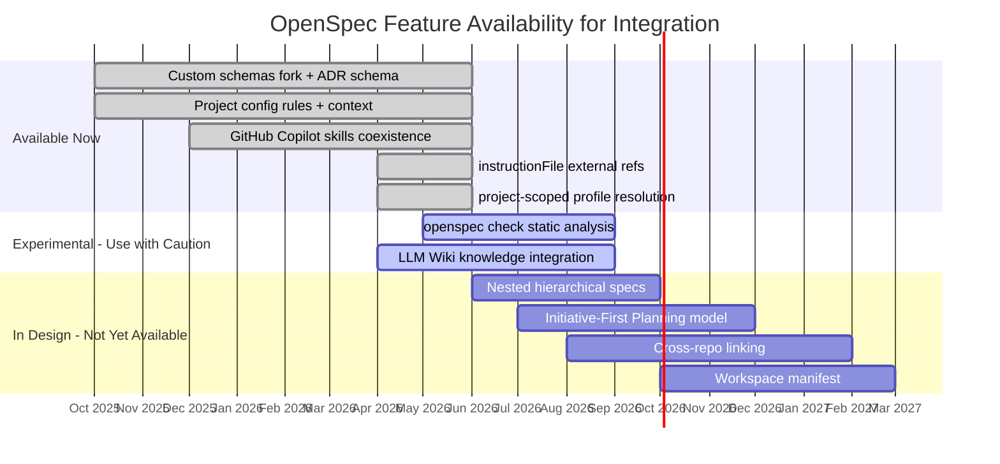
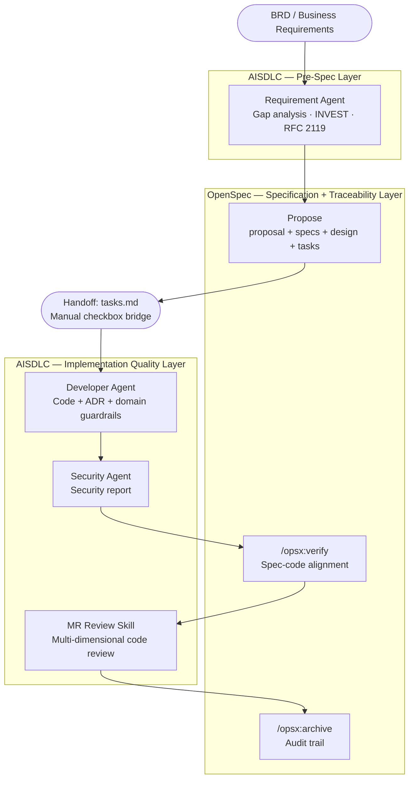

# OpenSpec + AISDLC Kit: Rational Integration Research
**Research Date: May 2026**
**Sources: OpenSpec official docs (all primary), workspace-architecture exploration, GitHub Copilot official docs, community research, GitHub Issues/Discussions**

> **Methodology applied throughout:**
> Every claim cites its source. Where official documentation speaks directly, it is cited verbatim or paraphrased with attribution. Where analysis is inferred from architecture, it is labeled as inference. Conflicting claims are noted explicitly.

---

## Table of Contents

1. [Terminology Clarification](#1-terminology-clarification)
2. [OpenSpec: What It Actually Is](#2-openspec-true-nature)
3. [The Critical Gap: BRD-Level vs Feature-Level](#3-brd-vs-feature-level)
4. [AISDLC Kit: Architectural Role](#4-aisdlc-role)
5. [Functional Overlap Analysis](#5-overlap-analysis)
6. [The Custom Skills Constraint: Root Cause](#6-custom-skills-constraint)
7. [The Tracking Problem: Implementation Outside OpenSpec](#7-tracking-problem)
8. [Multi-Project Support: Current State and Roadmap](#8-multi-project-support)
9. [Integration Architecture Options](#9-integration-options)
10. [Forward-Looking: OpenSpec 2026 Roadmap](#10-2026-roadmap)
11. [Decision Framework](#11-decision-framework)
12. [References](#12-references)

---

## 1. Terminology Clarification

Before analysis, three command names from initial research need correction. The distinctions are architecturally significant.

| Informal Term Used | Actual OpenSpec Command | What It Actually Does | Source |
|---|---|---|---|
| "validate" | `/opsx:verify` | Checks implementation against specs in three dimensions: Completeness, Correctness, Coherence | `commands.md` |
| "same" | `/opsx:sync` | Merges delta specs from a change folder INTO the main `openspec/specs/` directory | `commands.md` |
| "apply" | `/opsx:apply` ✓ | Reads `tasks.md` and writes code, creates files, checks off task boxes | `commands.md` |

**Why this matters:**
`/opsx:verify` reads the *codebase directly* — it does not depend solely on checkbox state. `/opsx:sync` is a forward-merge operation, not a comparison. These are two separate concerns that inform the tracking analysis in Section 7.

---

## 2. OpenSpec: What It Actually Is

### 2.1 The Marketing vs The Reality

OpenSpec's README states:

> "AI coding assistants are powerful but unpredictable when requirements live only in chat history. OpenSpec adds a lightweight spec layer so you agree on what to build before any code is written."

This is the *philosophy*. The label "spec-driven" describes what *drives* the work — not the limit of what the tool does.

### 2.2 The Full Lifecycle OpenSpec Manages

From `concepts.md`, the complete flow is:

```
propose → specs + design + tasks → apply (writes code) → verify → sync → archive
```

From `commands.md`, `/opsx:apply` behavior:

> "Reads `tasks.md` and identifies incomplete tasks. Works through tasks one by one. Writes code, creates files, runs tests as needed. Marks tasks complete with checkboxes."

**Conclusion:** OpenSpec manages the full cycle from intent to archived implementation. "Spec-driven" means specifications govern implementation — not that the tool stops at specifications.

### 2.3 The OpenSpec Lifecycle



### 2.4 The Archive: Audit Trail by Design

From `concepts.md`:

> "The archive preserves the full context of every change — not just what changed, but the proposal explaining *why*, the design explaining *how*, and the tasks showing the work done."

The `openspec/changes/archive/` directory is a **version-controlled, chronological audit trail** of intent-to-implementation lineage. This is a structural property of OpenSpec, not a side effect.

### 2.5 What OpenSpec Explicitly Is NOT

From `concepts.md` — what should NOT be in a spec:

> "Avoid: Internal class/function names. Library or framework choices. Step-by-step implementation details. Detailed execution plans (those belong in `design.md` or `tasks.md`)"

OpenSpec specs are **behavior contracts**, not implementation blueprints. This distinction defines where custom tooling (AISDLC) adds value.

---

## 3. The Critical Gap: BRD-Level vs Feature-Level

This is the most important analytical finding in this research. **It is not explicitly documented in OpenSpec's official docs, but is clearly derivable from the architecture and confirmed by community research.**

### 3.1 What Level Does OpenSpec Operate At?

From `concepts.md` — the core abstraction:

> "A **change** is a proposed modification to your system, packaged as a folder with everything needed to understand and implement it."

From the community article (zarar.dev, Feb 2026):

> "Spec driven development specs are feature level documents written in minutes and meant to evolve. You're not planning an entire system upfront; you're planning the **next meaningful chunk of work** in enough detail that an AI can implement it without guessing."

OpenSpec operates at the **change/feature level**. One change = one folder = one `proposal.md` + one `tasks.md` + delta specs for that specific change.

### 3.2 What a BRD Actually Is

A Business Requirements Document (BRD) is a strategic artifact that:
- Covers business objectives, project scope, and success metrics
- Spans multiple epics, features, and integrations
- Runs 5–50 pages for enterprise implementations
- Includes stakeholder roles, assumptions, constraints, cost-benefit analysis
- Is not directly implementable — it requires decomposition into features/stories

Source: `businessrequirements.org`, `asana.com/resources/business-requirements-document-template`

### 3.3 The Decomposition Gap



**OpenSpec's entry point is the GREEN boxes** — individual change-level features. It has no mechanism to ingest a BRD or decompose an epic into features. That decomposition layer does not exist in OpenSpec.

### 3.4 What the Community Confirms About This Gap

From zarar.dev (Payments Engineering team, Feb 2026):

> "The key principle: the BA's documents are input to the spec, not replaced by it. The OpenSpec proposal can reference them directly ('Field mappings follow the BA's pain.008 mapping document, see docs/ba-requirements/sepa-dd-field-mappings.xlsx')."

> "This conversation might reveal that 70% of the BA's requirements map cleanly to existing patterns and 30% require new design decisions. Those design decisions then flow into the proposal and spec with full context, rather than being invented by the AI from a one-sentence prompt."

**Evidence confirms:** BRD/BA documents are *upstream inputs* to OpenSpec, not content OpenSpec processes. A human or AI intermediary must decompose BRD content into individual OpenSpec changes.

### 3.5 Evidence Summary: The BRD Gap Is Real

| Layer | OpenSpec Coverage | Gap |
|---|---|---|
| BRD (strategic objectives, stakeholders, epics) | None | AISDLC requirement agent fills this |
| Epic decomposition into features | None | AISDLC INVEST/SPDT fills this |
| Feature-level spec writing | Core capability | Full coverage |
| Feature-level implementation | Core capability via `/opsx:apply` | Full coverage |
| Feature verification | Core capability via `/opsx:verify` | Full coverage |
| Audit trail per change | Core capability via `/opsx:archive` | Full coverage |

---

## 4. AISDLC Kit: Architectural Role

Based on the described architecture, the AISDLC kit provides:



**Key point:** The AISDLC kit operates across THREE layers that OpenSpec does not touch:
1. **Pre-spec layer**: BRD ingestion, requirement refinement, INVEST decomposition
2. **Implementation quality layer**: Coding guardrails, MR review, security audit
3. **Regulatory layer**: Domain-specific compliance rules embedded in always-on instructions

---

## 5. Functional Overlap Analysis

### 5.1 Stage-by-Stage Comparison

| SDLC Stage | OpenSpec Capability | AISDLC Capability | Overlap Level |
|---|---|---|---|
| BRD ingestion | None | requirements-analyst skill | AISDLC only |
| Epic decomposition | None | INVEST + SPDT | AISDLC only |
| Pre-spec exploration | `/opsx:explore` conversational | No equivalent | OpenSpec only |
| Requirement refinement | Proposal + specs (feature-level only) | Gap analysis + RFC 2119 | Partial overlap |
| Feature spec writing | Core — proposal + specs + design | INVEST stories | Different formats, same goal |
| Technical design | `design.md` artifact | ADR generation | Complementary |
| Task decomposition | `tasks.md` artifact | Implementation planning | Overlap |
| Code implementation | `/opsx:apply` — AI writes code | Developer agent | CRITICAL OVERLAP |
| Coding guardrails | `openspec/config.yaml` rules (generic) | `.github/copilot-instructions.md` (domain-specific) | AISDLC deeper |
| Security review | None | Security agent + report | AISDLC only |
| MR review | None | Multi-dimensional MR review | AISDLC only |
| Spec-code verification | `/opsx:verify` | No equivalent | OpenSpec only |
| Spec persistence | `openspec/specs/` — living truth | No equivalent | OpenSpec only |
| Audit trail | `openspec/changes/archive/` | No equivalent | OpenSpec only |
| Multi-tool support | 28 AI tools | GitHub Copilot Agent Mode | OpenSpec broader |
| CI/CD integration | `openspec validate --json` (scripted) | GitLab CI orchestration | AISDLC deeper |

### 5.2 The Critical Implementation Overlap

The only point where both tools try to do the same thing simultaneously is **code implementation**:
- OpenSpec does it via `/opsx:apply` (generic, task-checkbox-driven)
- AISDLC does it via developer agent (guardrail-aware, domain-specific)

This overlap defines the primary architectural decision: **who writes the code?** The answer determines the tracking model.

---

## 6. The Custom Skills Constraint: Root Cause

This is a previously undiagnosed constraint. The root cause is now confirmed through primary source research.

### 6.1 How GitHub Copilot's Skill System Works

From `docs.github.com/en/copilot` (official):

> "Agent skills are folders of instructions, scripts, and resources that Copilot can load when **relevant** to improve its performance in specialized tasks."

> "When Copilot **chooses** to use a skill, the SKILL.md file will be injected in the agent's context, giving the agent access to your instructions."

Skills live in `.github/skills/<skill-name>/SKILL.md`. Copilot reads the `description` field and determines whether a skill is relevant to the current prompt context.

From GitHub community discussion:

> "Use custom instructions for anything that should **always apply**, regardless of which agent or skill is being used... Skills for **task-specific logic** that can be reused in multiple contexts."

### 6.2 Where the Constraint Lives



### 6.3 The Three Root Causes

**Root Cause 1 — Context window dominance:**
When Copilot executes `/opsx-apply`, the OpenSpec skill's instructions fill the context. AISDLC skills have description triggers designed for their own use cases (code review, security audit). They do not match the "implement tasks from checklist" context.

**Root Cause 2 — No skill-chaining mechanism:**
OpenSpec SKILL.md files have no `include`, `chain`, or `callback` mechanism to invoke other skills. The `openspec-apply-change` skill is self-contained. From `supported-tools.md`:

> "OpenSpec installs workflow artifacts based on selected workflows."

The workflow artifacts are isolated by design. There is no hook point for external skills.

**Root Cause 3 — Copilot CLI does not support prompt files:**
From `supported-tools.md` (official OpenSpec documentation):

> "GitHub Copilot prompt files are recognized as custom slash commands in **IDE extensions** (VS Code, JetBrains, Visual Studio). **Copilot CLI does not currently consume `.github/prompts/*.prompt.md` directly.**"

This is a hard constraint for any GitLab CI pipeline attempting to trigger OpenSpec commands programmatically.

### 6.4 What This Means Practically

The constraint is NOT a hard technical block on coexistence. AISDLC skills and OpenSpec skills both live in `.github/skills/`. They coexist without conflict. The constraint is:

> When Copilot is executing an OpenSpec workflow command, it follows OpenSpec's instructions for that command. AISDLC skills will not fire mid-flight unless explicitly invoked with a matching prompt.

**The solution is workflow design** — defining where OpenSpec ends and AISDLC begins (and the handoff mechanism between them). This is the integration architecture problem addressed in Section 9.

---

## 7. The Tracking Problem: Implementation Outside OpenSpec

### 7.1 The Problem Is Real

If AISDLC implements code instead of `/opsx:apply`, the task checkboxes in `tasks.md` are not automatically updated.

From `commands.md` — how `/opsx:apply` tracks implementation:

> "Reads `tasks.md` and identifies incomplete tasks. Works through tasks one by one. Marks tasks complete with checkboxes `[x]`."

And from `/opsx:verify` behavior:

> "Checks three dimensions: **Completeness** (all tasks done, all requirements implemented, scenarios covered)..."

If checkboxes remain unchecked, `/opsx:verify` reports incomplete work even if the code exists.

### 7.2 However: `/opsx:verify` Also Reads the Codebase

A critical nuance from `commands.md`:

> "Searches codebase for implementation evidence."

`/opsx:verify` does NOT rely solely on checkbox state. It cross-checks actual code against spec requirements. This means:
- Even with unchecked boxes, `/opsx:verify` can find implementation evidence
- Warnings about checkbox incompleteness are warnings, not blocks
- From `commands.md`: "Does not block archive, but surfaces issues"

### 7.3 The Tracking Model



### 7.4 Solving the Tracking Problem

Three resolution strategies, in ascending implementation complexity:

**Strategy 1 — Manual Bridge (simplest):**
Developer manually updates `tasks.md` checkboxes after AISDLC implements each task. `/opsx:verify` and `/opsx:archive` then function normally. Human-mediated but fully functional. Appropriate when a human review step is required anyway.

**Strategy 2 — CI Script Bridge:**
A CI job parses completed MR metadata (task IDs referenced in commit messages or MR descriptions) and updates `tasks.md` checkboxes programmatically before `/opsx:verify` runs. This is achievable with a lightweight script without requiring REST API access.

**Strategy 3 — AISDLC Skill Enhancement:**
Add a post-task-completion step to the AISDLC developer agent skill that writes the checkbox update back to `tasks.md` via git after each task implementation. This is a skill-level addition to AISDLC, not an OpenSpec change.

---

## 8. Multi-Project Support: Current State and Roadmap

This is one of the most significant gaps in OpenSpec's current architecture — and one of the most actively designed areas for 2026.

### 8.1 Current State (May 2026)

From `concepts.md`:

> "OpenSpec organizes your work into two main areas: `openspec/specs/` (source of truth) and `openspec/changes/` (proposed modifications)."

From `workspace-architecture.md` (OpenSpec's own internal exploration doc):

> "OpenSpec currently assumes: One `openspec/` per repo, always at root. CLI doesn't walk up directories — expects you're at root. Changes can touch ANY spec (no scoping). Single config applies to everything. No notion of 'scope' or 'boundary' within a project."

**Current multi-project workarounds (from Issue #725 community responses):**

- Create a separate "workspace" repo and use custom research skills within teams pointing agents at relevant code repos
- Use `openspec/config.yaml` context field to describe cross-repo relationships
- Manually coordinate multiple `openspec/` roots in separate terminal sessions

None of these are first-class features. They are workarounds.

### 8.2 The Scale Problem

From Issue #662 (Feb 2026):

> "OpenSpec currently assumes a flat spec structure where each capability is a direct subdirectory under `specs/`. This works for simple projects but becomes limiting. **Teams need hierarchical organization for: Domain-driven design, Monorepos, Cross-cutting concerns, Team namespaces.**"

> "**Commands like `openspec list --specs`, validation, sync, and archive fail to discover or work with hierarchically organized specs**, forcing teams to use workarounds or manual processes."

This is an open issue as of May 2026.

### 8.3 The Workspace Architecture Design (April 2026)

From `workspace-architecture.md` (OpenSpec's own internal design doc, April 2026):

The team evaluated four models (A: Flat Root, B: Nested Specs, C: Distributed, D: Hybrid) and converged on:

**Model D with Lazy Workspace:**

> "Each repo keeps its own canonical `openspec/`. Cross-root work can be coordinated through an **initiative** in a coordination workspace. 'Workspace' is a derived or explicit coordination view over linked repos and linked changes, not something users must register upfront."

The **Initiative-First Planning** model for multi-repo:

```
coordination-workspace/
  .openspec-workspace/
    workspace.yaml
    initiatives/
      feature-xyz/
        initiative.yaml      ← shared proposal + design
        proposal.md
        design.md
        links.yaml           ← maps to per-repo changes

repo-A/
  openspec/
    changes/
      feature-xyz-api/       ← repo-A's execution artifact
        .openspec.yaml
        tasks.md
        specs/

repo-B/
  openspec/
    changes/
      feature-xyz-web/       ← repo-B's execution artifact
        .openspec.yaml
        tasks.md
        specs/
```

From the design doc:

> "The initiative holds the shared planning layer: proposal/intent, shared design and tradeoffs, participating teams, impacted repos, milestones and dependencies. Each repo-local change holds the execution layer for that repo."

**Implementation path defined (from the doc):**
1. Define initiative artifacts
2. Extend change metadata (link to initiative)
3. Extend spec metadata (add `references` field)
4. Build project resolution (offline-first)
5. Build initiative and link views
6. Support ad-hoc multi-root
7. Optional workspace manifest

### 8.4 Current Multi-Project Architecture Constraints Summary



---

## 9. Integration Architecture Options

### 9.1 The Core Design Question

Given the evidence:
- OpenSpec is a feature-level tool (not BRD-level)
- AISDLC covers the BRD → Feature decomposition layer
- OpenSpec covers spec persistence and audit trail (which AISDLC lacks)
- The implementation overlap (who writes code) must be resolved
- Multi-project support is a current gap in OpenSpec

There are four viable integration architectures.

---

### Option A: Layered — AISDLC Pre/Post, OpenSpec Core



**Pros:**
- Clear layer assignment — no ambiguity about tool ownership
- OpenSpec provides spec persistence + audit trail (AISDLC gap)
- AISDLC provides BRD decomposition + implementation guardrails + MR review (OpenSpec gaps)
- Both tools add value without duplication
- Operational today with no new tooling

**Cons:**
- Manual checkbox bridge required (Strategy 1 or 2 from Section 7)
- Two systems for the team to learn
- No automated spec-to-AISDLC-guardrail injection
- Risk: OpenSpec spec artifacts and AISDLC guardrails evolve independently

**Assessment:** Recommended for immediate adoption. Highest value-for-effort ratio.

---

### Option B: OpenSpec Full Lifecycle + AISDLC Bookends



**Pros:**
- Simplest operational model once teams learn OpenSpec
- No tracking problem (OpenSpec manages its own checkboxes)
- AISDLC adds stages OpenSpec has no equivalent for
- Lower cognitive load during implementation phase

**Cons:**
- `/opsx:apply` implements without domain-specific guardrails from AISDLC's developer agent
- AISDLC's developer agent value (ADR generation, implementation planning) is not applied during coding
- `.github/copilot-instructions.md` always-on guardrails still apply passively

**Assessment:** Viable for projects where the developer agent's skill-based guidance during implementation is less critical. Lower total AISDLC utilization.

---

### Option C: OpenSpec with Custom Schema Embedding Domain Concepts

Fork the `spec-driven` schema and embed AISDLC concepts as custom artifacts:

```
openspec schema fork spec-driven domain-sdlc
```

Resulting custom schema artifacts:

```yaml
# openspec/schemas/domain-sdlc/schema.yaml
artifacts:
  - id: proposal
    generates: proposal.md
    requires: []
  - id: specs
    generates: specs/**/*.md
    requires: [proposal]
  - id: adr
    generates: adr.md          # Custom: ADR artifact
    requires: [proposal]
  - id: design
    generates: design.md
    requires: [proposal]
  - id: security-checklist
    generates: security-checklist.md   # Custom: security artifact
    requires: [specs, design]
  - id: tasks
    generates: tasks.md
    requires: [specs, design, adr]
```

And `openspec/config.yaml` with domain rules:

```yaml
schema: domain-sdlc
context: |
  Stack: [describe your stack]
  Compliance: [describe regulatory requirements]
rules:
  proposal:
    - Include rollback plan
    - Flag if change touches financial calculations
  specs:
    - Use RFC 2119 keywords (MUST/SHALL/SHOULD)
    - Include audit trail scenario for data-mutating operations
    - Include unauthorised access scenario for protected resources
  design:
    - Document ADR for all significant architectural decisions
  tasks:
    - Group tasks: infrastructure / backend / frontend / test / security
    - Include explicit security review task
```

**Pros:**
- Single workflow for the team
- Domain concepts embedded in OpenSpec artifact generation
- Version-controlled custom schema
- Community precedent: `spec-driven-with-adr` already exists (intent-driven.dev, April 2026)

**Cons:**
- Does NOT replace AISDLC's live skill execution during implementation
- High initial setup investment
- Schema must be maintained in sync with AISDLC guardrail evolution
- `/opsx:apply` still implements without AISDLC developer agent skill

**Assessment:** Best combined with Option A — custom schema improves OpenSpec spec quality while AISDLC still handles BRD decomposition and implementation.

---

### Option D: AISDLC Standalone, OpenSpec Deferred

Use AISDLC kit without OpenSpec integration, deferring OpenSpec until the kit is stable and the team is comfortable.

**Pros:**
- Single system to learn and maintain
- Lower immediate complexity
- AISDLC kit can evolve without OpenSpec compatibility constraints

**Cons:**
- No persistent spec source of truth (AISDLC gap remains)
- No version-controlled audit trail of why/what/how decisions were made
- No spec-code verification step
- Multi-project expansion will encounter this gap again without OpenSpec

**Assessment:** Viable for short-term. The audit trail gap becomes significant as project scale and longevity increase.

---

## 10. Forward-Looking: OpenSpec 2026 Roadmap

### 10.1 What Is Already Merged (Available Now)

| Feature | PR/Release | Date | Impact |
|---|---|---|---|
| `instructionFile` support — external instruction file references in `openspec/config.yaml` | PR #1021 | April 30, 2026 | Can inject external guardrail files into OpenSpec artifact generation |
| Project-scoped profile resolution | PR #1012 | April 25, 2026 | Different profiles per project in same org |
| Action-based workflow (replaced rigid phases) | v1.0 release | Jan 2026 | Fluid artifact editing |
| Dynamic instructions (3-layer: context + rules + templates) | v1.0 release | Jan 2026 | Config-driven AI instructions |
| Semantic spec syncing (ADDED/MODIFIED/REMOVED markers) | v1.0 release | Jan 2026 | Conflict-aware spec merging |
| Custom schemas + project-local schemas | Stable | Oct 2025 | Domain-specific workflows |
| `spec-driven-with-adr` community schema | Community | April 2026 | ADR artifact out of the box |

### 10.2 In Active Development (Experimental / Open PRs)

| Feature | PR/Issue | Status | Impact |
|---|---|---|---|
| `openspec check` — static analysis command for CI integration | PR #1105 (May 20, 2026) | Open | Validates specs in CI before implementation |
| Trae command adapter | PR #1090 | Open | Expanded tool support |
| Hermes Agent support | PR #1095 | Open | Another AI tool integrated |
| Fix: validate artifact content before marking workflow step done | PR #1098 | Open | More reliable artifact state tracking |
| LLM Wiki integration for knowledge management | PR #998 | Open | Cross-session knowledge persistence |

### 10.3 In Design Phase (Architected, Not Yet Implemented)

This section is sourced from `workspace-architecture.md` (OpenSpec's own internal exploration, April 2026):

| Feature | Design Doc Reference | Expected Impact |
|---|---|---|
| **Nested/hierarchical spec structure** | Issue #662 | Enables Domain-Driven Design spec organization, monorepo support |
| **Initiative-First Planning model** | workspace-architecture.md Part 10 | Cross-repo feature coordination with shared proposal/design + linked per-repo changes |
| **Cross-repo linking via stable project identifiers** | workspace-architecture.md Part 10 | Multi-repo features trackable via `github.com/org/repo` identifiers |
| **Offline-first project resolution** | workspace-architecture.md Part 10 | Local registry of known project paths, no upfront workspace config required |
| **Workspace manifest (optional, lazy)** | workspace-architecture.md Part 10 | Opt-in coordination view over multiple repos |
| **Spec-level `references` field** | workspace-architecture.md Part 10 | Informational cross-repo spec pointers (documentation-only in v1) |

### 10.4 The `instructionFile` Feature: Immediate Integration Opportunity

PR #1021, merged April 30, 2026, adds support for referencing external instruction files from `openspec/config.yaml`. This is the first official mechanism to bridge AISDLC's guardrails into OpenSpec's artifact generation pipeline.

**What this enables today (experimental):**

```yaml
# openspec/config.yaml
schema: spec-driven
instructionFile: .github/copilot-instructions.md   # reference AISDLC guardrails
context: |
  [project context]
rules:
  specs:
    - Use RFC 2119 keywords
    - Include audit trail scenario for data-mutating operations
```

When OpenSpec generates artifacts (proposal, specs, design, tasks), it will inject the referenced instruction file's content into the AI context. This means AISDLC's coding standards and compliance rules will inform OpenSpec spec generation without separate skill invocation.

**Caveat:** This feature is marked experimental in the PR. Track stability before relying on it in production.

### 10.5 Timeline View



### 10.6 Forward-Looking Impact on AISDLC Integration

| OpenSpec Feature | Impact on AISDLC Integration |
|---|---|
| `instructionFile` (now experimental) | AISDLC guardrails can be injected into OpenSpec spec generation — partial automatic bridging |
| `openspec check` (coming) | Static spec validation in CI — could run alongside AISDLC's CI validation |
| Nested specs (in design) | Enables BRD-style domain organization in `openspec/specs/` — closer to AISDLC's multi-domain thinking |
| Initiative-First Planning (in design) | Cross-service features coordinated via initiative.md — aligns with AISDLC's multi-team requirement decomposition |
| Cross-repo linking (in design) | Multi-repo spec traceability — reduces the current manual coordination overhead when AISDLC spans services |

---

## 11. Decision Framework

### 11.1 Answering the Core Questions

**Q: Is OpenSpec just a specification tool?**
**A: No.** `/opsx:apply` writes code. The full lifecycle includes implementation and archive. "Spec-driven" describes the philosophy, not the scope limit.

**Q: Does OpenSpec operate at BRD level or feature level?**
**A: Feature level only.** One change = one feature-scoped folder. BRD → Epic → Feature decomposition is explicitly outside OpenSpec's scope and must be done upstream. This is a confirmed gap, not a debatable interpretation.

**Q: Why can't AISDLC custom skills trigger inside OpenSpec workflows?**
**A: Context isolation + no skill-chaining mechanism.** When Copilot executes an OpenSpec command, context is dominated by OpenSpec's instructions. AISDLC skills don't match the trigger conditions. This is a workflow boundary, not a hard technical block. The solution is defined handoff points between tools.

**Q: Is the tracking problem real when AISDLC implements instead of `/opsx:apply`?**
**A: Partially real, fully solvable.** Task checkbox state is not updated automatically. However, `/opsx:verify` reads the codebase directly and will surface implementation evidence regardless of checkbox state. The gap is warnings and imperfect task-level granularity — not a broken system.

**Q: Does OpenSpec support multiple projects today?**
**A: No.** One `openspec/` per repo, flat spec structure, no cross-repo tracking. Multi-project support is in the design phase (workspace-architecture.md, April 2026). The Initiative-First Planning model is designed but not implemented.

**Q: Should both tools be used together?**
**A: Yes, as complementary layers.** OpenSpec fills the spec persistence and audit trail gap that AISDLC has no equivalent for. AISDLC fills the BRD decomposition, implementation guardrails, MR review, and security review gaps that OpenSpec has no equivalent for.

### 11.2 Where Each Tool Owns the Stage



### 11.3 Minimum Viable Integration Steps

**Step 1 (Today, no new tooling):**
Add `openspec/config.yaml` with domain-specific context and rules. This immediately improves OpenSpec artifact quality by injecting domain knowledge. Takes 15 minutes.

**Step 2 (Today, operational):**
Run AISDLC requirement agent first on any BRD input. Use the output as the prompt context when invoking `/opsx:propose`. This creates the upstream handoff between AISDLC and OpenSpec.

**Step 3 (Today, operational):**
After AISDLC developer agent implements tasks from `tasks.md`, manually update task checkboxes. Then run `/opsx:verify` and `/opsx:archive`. This completes the downstream handoff from AISDLC back to OpenSpec.

**Step 4 (Short-term, when `instructionFile` stabilizes):**
Add `instructionFile: .github/copilot-instructions.md` to `openspec/config.yaml` to inject AISDLC's always-on guardrails into OpenSpec's spec generation context.

**Step 5 (Medium-term, when hierarchical specs ship):**
Reorganize `openspec/specs/` into domain hierarchy matching AISDLC's requirement domain structure. This aligns the spec organization with the BRD decomposition model.

---

## 12. References

| Document | URL | Date |
|---|---|---|
| OpenSpec concepts.md | https://github.com/Fission-AI/OpenSpec/blob/main/docs/concepts.md | Current |
| OpenSpec commands.md | https://github.com/Fission-AI/OpenSpec/blob/main/docs/commands.md | Current |
| OpenSpec workflows.md | https://github.com/Fission-AI/OpenSpec/blob/main/docs/workflows.md | Current |
| OpenSpec customization.md | https://github.com/Fission-AI/OpenSpec/blob/main/docs/customization.md | Current |
| OpenSpec supported-tools.md | https://github.com/Fission-AI/OpenSpec/blob/main/docs/supported-tools.md | Current |
| OpenSpec cli.md | https://github.com/Fission-AI/OpenSpec/blob/main/docs/cli.md | Current |
| OpenSpec workspace-architecture.md | https://github.com/Fission-AI/OpenSpec/blob/main/openspec/explorations/workspace-architecture.md | April 2026 |
| OpenSpec Issue #725: Multi-repo support | https://github.com/Fission-AI/OpenSpec/issues/725 | Feb 2026 |
| OpenSpec Issue #662: Hierarchical specs | https://github.com/Fission-AI/OpenSpec/issues/662 | Feb 2026 |
| OpenSpec PR #1021: instructionFile | https://github.com/Fission-AI/OpenSpec/pulls | April 30, 2026 |
| OpenSpec PR #1105: check command | https://github.com/Fission-AI/OpenSpec/pulls | May 20, 2026 |
| GitHub Copilot: Adding agent skills (official) | https://docs.github.com/en/copilot/how-tos/copilot-on-github/customize-copilot/customize-cloud-agent/add-skills | Current |
| GitHub Copilot: CLI skills (official) | https://docs.github.com/en/copilot/how-tos/copilot-cli/customize-copilot/add-skills | Current |
| spec-driven-with-adr community schema | https://intent-driven.dev/knowledge/openspec/ | April 2026 |
| OpenSpec + Payments Engineering (zarar.dev) | https://zarar.dev/spec-driven-development-from-vibe-coding-to-structured-development/ | Feb 2026 |
| SDD deep dive — Kiro vs OpenSpec vs Spec-Kit | https://ranthebuilder.cloud/blog/i-tested-three-spec-driven-ai-tools-here-s-my-honest-take/ | April 2026 |
| OpenSpec DeepWiki (architecture) | https://deepwiki.com/Fission-AI/OpenSpec | May 2026 |
| Spec-Driven Development enterprise scale (InfoQ) | https://www.infoq.com/articles/spec-driven-development-enterprise | 2026 |

---

*Research completed May 2026. All primary sources fetched directly from official repositories and official documentation. Community sources cited by URL with date.*
