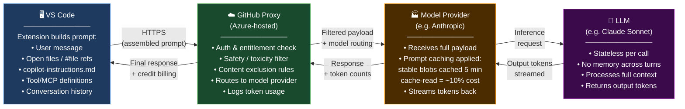
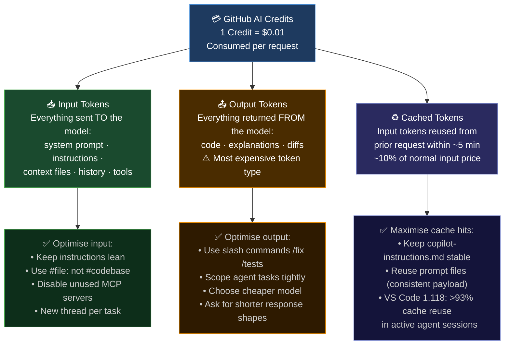

# GitHub Copilot in VS Code — Effective Usage Guide

> **Purpose:** Help engineers use Copilot productively while keeping AI Credit consumption intentional and controlled.  
> **Audience:** Developers already set up with GitHub Copilot in VS Code.

---

## 1. Copilot Capabilities in VS Code — At a Glance

GitHub Copilot in VS Code operates across four distinct interaction modes:

| Mode | What it does | Token cost |
|---|---|---|
| **Inline Completions** | Ghost-text suggestions as you type | Free (base model, unlimited) |
| **Chat (Ask mode)** | Single-turn Q&A in the Chat panel | Low–Medium |
| **Copilot Edits** | Multi-file edits driven by a single prompt | Medium |
| **Agent Mode** | Autonomous multi-step tasks — reads files, runs terminal, iterates, calls tools | High |

**Key features (VS Code):**

- **`copilot-instructions.md`** — Persistent instruction file at `.github/copilot-instructions.md`; injected into *every* Chat and Agent request automatically. Single most impactful customisation file.
- **Path-specific instructions** — `.github/instructions/*.instructions.md` with `applyTo:` frontmatter, scoped to file patterns (e.g., only `*.test.ts` files).
- **Prompt files** — `.github/prompts/*.prompt.md`; reusable, triggerable task blueprints invoked as `/command-name` in Chat.
- **Agent Skills** — Folders of instructions, scripts, and resources loaded on-demand when relevant to the task. Open standard ([agentskills.io](https://agentskills.io)), portable across VS Code, Copilot CLI, and cloud agent.
- **`#codebase` context** — Semantic + keyword + file-name multi-strategy workspace search before responding.
- **Next Edit Suggestions** — Predicts and pre-fills the next likely edit after a change; press `Tab` to accept.
- **Vision input** — Paste screenshots or mockups directly into Chat to generate UI code.
- **MCP integration** — Agent Mode calls external tools (databases, APIs, GitHub) via Model Context Protocol servers.
- **Context window indicator** — Hover the token count in the Chat input box to see a breakdown by category (system prompt, context, history). Use it before running expensive agent sessions.

---

## 2. What Gets Loaded Into Context — And When

This is the most important thing to internalise. Every item loaded into context becomes **input tokens you pay for**. Some things load automatically on every request; others load only under specific conditions. Knowing the difference lets you design your workspace to minimise unnecessary token spend.

### Context loading reference

| Artefact | Location | When loaded | Scope | Cost implication |
|---|---|---|---|---|
| `copilot-instructions.md` | `.github/copilot-instructions.md` | **Always** — every Chat and Agent request | Workspace | Recurring cost every turn — keep it lean |
| `AGENTS.md` | `/AGENTS.md` (root) | **Always** — every Chat and Agent request | Workspace | Avoid duplicating content already in `copilot-instructions.md` |
| User instructions | VS Code settings (`github.copilot.chat.codeGeneration.instructions`) | **Always** — every request, all workspaces | Global (user) | Crosses all projects — keep especially tight |
| Org-level instructions | GitHub organisation settings | **Always** — every request within the org | Organisation | Set once, applies everywhere in the org |
| `.instructions.md` files | `.github/instructions/*.instructions.md` | **Conditional** — only when the active/referenced file matches `applyTo:` glob | File-pattern scoped | Efficient: only fires when the matched file type is in scope |
| Prompt files (`.prompt.md`) | `.github/prompts/*.prompt.md` | **On-demand only** — when you invoke `/command-name` in Chat | Per invocation | No passive cost; consumed only when triggered |
| Custom agent (`.agent.md`) | `.github/agents/*.agent.md` | **Conditional** — system prompt injected only when that agent is selected in Chat | Per agent selection | Zero cost unless the agent is active |
| Agent Skills — metadata only | `.github/skills/<name>/SKILL.md` | **Always** (startup) — only `name` + `description` fields (~100 tokens per skill) loaded for all discovered skills | All skills, always | Minimal; write tight descriptions — this is what Copilot reads to decide relevance |
| Agent Skills — full body | `.github/skills/<name>/SKILL.md` | **Conditional** — full `SKILL.md` body loaded only when the agent matches your intent to this skill's description | Per activation | Keep body under 5,000 tokens (recommended); split larger content into referenced files |
| Agent Skills — resource files | `.github/skills/<name>/scripts/`, `references/`, etc. | **On-demand** — loaded only as the agent explicitly references them during execution | Per file access | Not loaded speculatively; smaller reference files = less context consumed per use |
| MCP tool definitions | Active MCP server configs | **Always while server connected** — tool schemas injected on every Agent turn | Per connected server | ~100–500 tokens per server per step; disable unused servers |

### Key rules that fall out of this table

**Always-loaded artefacts accumulate on every turn.** `copilot-instructions.md` + `AGENTS.md` + User instructions + Org instructions are all injected regardless of what you ask. If these total 2,000 tokens, that's 2,000 input tokens on a simple "what does this function do?" question. Design them to be minimal and non-redundant.

**Path-specific instructions are the efficient alternative.** Instead of putting test conventions in `copilot-instructions.md` (loaded always), put them in `.github/instructions/tests.instructions.md` with `applyTo: "**/*.test.*"` — they only fire when a test file is in scope.

**Agent Skills use three-level progressive loading.** Only the `name` + `description` of every discovered skill (~100 tokens each) is loaded at startup so the agent can reason about relevance. The full `SKILL.md` body is loaded only when the agent decides this skill matches your intent. Resource files (scripts, references) are loaded further on demand as the agent references them. This design means you can have many skills installed without context bloat — but it makes the `description` field the critical token: write it precisely so the agent activates the right skill at the right time. ([agentskills.io spec](https://agentskills.io/specification.md))

**Prompt files cost nothing passively.** They are loaded only when explicitly invoked via `/command-name`. The right home for detailed, repeatable, task-specific instructions.

**MCP servers are always-on when connected.** Their tool definitions inject on every Agent step. Disconnect or disable servers you are not using in the current session.

---

## 3. How a Copilot Request Actually Flows

Understanding the request pipeline explains *where* tokens are created — and where they can be reduced.



**What this means in practice:**

The VS Code extension assembles the full prompt *locally* before a single byte leaves your machine. Every item in the always-loaded category above becomes input tokens before the request even reaches GitHub. The GitHub Proxy filters and routes — it does not compress or summarise. The model provider (Anthropic, OpenAI, etc.) receives the exact payload and applies **prompt caching**: stable content (system prompt, large instruction blocks, recurring file blobs) is cached with a ~5-minute window and costs roughly **10% of normal input token price** on reuse.

VS Code 1.118 (April 2026) added client-side prompt caching achieving **>93% cache reuse per agent turn** for stable context — a significant cost reduction for agentic sessions.

The model itself is **stateless**: it has no memory between calls. Full conversation history is re-sent on every turn, which is the primary driver of rising input costs in long chat threads.

> **Takeaway:** Reduce what the extension assembles, and you reduce what the proxy sends, which reduces what the model bills. Context control starts in VS Code.

---

## 4. Using Copilot Effectively — With Minimum Token Spend

### 4.1 Understand the Billing Model (June 2026)

As of June 1, 2026, Copilot moved from flat Premium Request Units to **token-based AI Credits** (`1 Credit = $0.01`). Plan included credits: Pro $15/mo · Pro+ $39/mo · Business $19/user · Enterprise $39/user — overage billed at each model's published token rate.

**What gets billed — and how to optimise each type:**



**Model cost spread is an order of magnitude wide:**

| Model | Input ($/M tokens) | Output ($/M tokens) | Relative cost |
|---|---|---|---|
| GPT-4.1 / GPT-5 mini | **Free (included)** | **Free (included)** | Zero credits |
| Claude Haiku 4.5 | Low | ~$5 | Very low |
| Claude Sonnet 4.6 | ~$3 | ~$15 | Medium |
| Claude Opus 4.x / GPT-5.5 | ~$15–75 | ~$25–75 | Very high |

> **Rule #1 — Match model to task.** The same agent session costs ~$0.007 on a nano model vs ~$1.85 on GPT-5.5 — a 24× gap. Output tokens dominate cost: a 5K-token input with 50K-token output on GPT-5.5 costs ~$1.53 vs ~$0.23 on a flash model.

---

### 4.2 Control Context — The Biggest Token Lever

Everything assembled by the VS Code extension becomes input tokens. The loading table in Section 2 shows exactly what fires and when. The highest-impact controls:

**a) Keep always-loaded artefacts lean and non-redundant.**  
`copilot-instructions.md`, `AGENTS.md`, and User instructions all inject on every request. If all three exist and overlap, you're paying for duplicate content on every turn. Pick one workspace instruction source and keep it tight.

```markdown
# .github/copilot-instructions.md — directive, not descriptive
- Stack: Java 17, Spring Boot 3.x, React 18 + TypeScript
- API style: RESTful; OpenAPI 3.1 spec required for new endpoints
- No Lombok in new code — use records
- All DB access via repository interfaces only
- Tests: JUnit 5 + Mockito; no PowerMock
- No field injection — constructor injection only
```

5–8 directive lines beats 3 paragraphs of background. Every extra word recurs on every request.

**b) Move file-type-specific rules to path-scoped instructions.**  
Instead of putting test conventions in the global instructions file, scope them:

```markdown
# .github/instructions/tests.instructions.md
---
applyTo: "**/*.test.ts,**/__tests__/**/*.ts"
---
- Use Jest + React Testing Library
- No enzyme-style APIs
- Assert user-visible outcomes, not implementation details
- Mock all network calls
```

These fire only when a test file is active — not on every Java or YAML request.

**c) Use `#file` instead of `#codebase` when you know the relevant file.**

```
// ❌ Triggers a wide workspace search — more tokens, less precise
@workspace explain the auth flow

// ✅ Pin exactly what's needed
#file:src/auth/JwtTokenFilter.java explain the auth flow
```

**d) Start a new Chat thread per task.**  
The model is stateless; each turn re-sends full history. Long threads with stale context raise input costs on every follow-up. New thread = clean slate.

**e) Disable MCP servers you are not actively using.**  
Each connected MCP server injects its tool definitions on every Agent step (~100–500 tokens each), even if you never call that tool.

> In VS Code: open the Chat panel → click the **tools icon** (wrench) → untick individual MCP servers before a session. Or go to `Settings → search "mcp"` to disable at the server level.

**f) Close irrelevant open tabs.**  
Open editor tabs are used as implicit context for inline completions. Close anything not relevant to the current task.

---

### 4.3 Prompt Precision — Say Less, Mean More

Vague prompts force Copilot to guess → longer outputs → correction turns → more tokens overall. Specify task + constraints + output shape in one prompt.

```
// ❌ Vague
Write a service for user management

// ✅ Precise — generates right output first time
Create UserService.java with Spring Boot 3 constructor injection.
Methods: createUser(UserDto), findById(UUID), deactivate(UUID).
Throw ResourceNotFoundException if user not found.
No Lombok. No field injection.
```

---

### 4.4 Prefer Inline Completions for Boilerplate

Inline completions are **free** (base model, unlimited). For DTOs, getters, test skeletons, import statements — let ghost-text complete rather than opening Chat. Guide completions with a leading comment:

```java
// Returns active users sorted by registration date, most recent first
public List<User> getActiveUsersSortedByRegistration() {
    // start typing — Copilot completes the body at zero credit cost
```

A clear comment before the method signature is the cheapest and most reliable Copilot input.

---

### 4.5 Use Prompt Files for Repeated Workflows

Encode repeated multi-step instructions as `.prompt.md` files. Invoked with `/command-name`, they inject a consistent, cache-friendly payload — not a re-typed verbose prompt each time. Prompt files cost nothing passively (see Section 2 loading table).

```markdown
---
description: "Scaffold a new Spring Boot REST controller"
---
# .github/prompts/new-controller.prompt.md
Create a Spring Boot 3 REST controller for ${entity}.
- Constructor injection, @RestController, @RequestMapping
- GET (list + byId), POST, PUT, DELETE endpoints
- Delegate to ${entity}Service
- ResponseEntity with appropriate HTTP status codes
- OpenAPI annotations: @Operation, @ApiResponse
```

Invoke with: `/new-controller entity=Order` — Copilot already knows the stack from `copilot-instructions.md`; the prompt file adds only the task-specific delta.

---

### 4.6 Agent Mode — Use With a Budget in Mind

Agent Mode is the most token-intensive workflow. A scoped architecture-and-refactor session on Sonnet 4.6 (~10K context + 40K diff) costs approximately **~$1.45 in credits**. An unbounded session over a large codebase can exhaust a Pro monthly budget in one run.

**Before running Agent Mode:**

1. **Scope tightly.** Specify the exact file, method, or class boundary.
2. **Select the cheapest capable model.** Sonnet 4.6 gives near-frontier quality at ~5× lower cost than Opus.
3. **Disable unused MCP servers** (see §4.2e) before the session starts.
4. **Set a budget cap.** GitHub Billing → Spending Limits → per-user cap. Default is *off*.

```
// ❌ Unbounded — agent reads and diffs everything
Refactor the order service

// ✅ Bounded — agent stays in one method
In OrderService.java, extract discount calculation from processOrder()
into a private calculateDiscount(Order order) method. No other changes.
```

---

### 4.7 Inspect Token Usage — Use the Debug View

Before optimising, measure. VS Code has a built-in token inspector:

> **Command Palette → `Developer: Show Chat Debug View`**

This shows per-turn breakdowns: system prompt tokens, context tokens, cached tokens, output tokens, and model used. Use it to identify which requests are expensive and why before changing behaviour.

---

## 5. VS Code Chat Commands — Reference

Slash commands are shorthand prompts for common tasks. They constrain the output surface, which typically means fewer output tokens than an open-ended Chat question.

> **Tip:** Type `/` in the Chat input to see the full live list in your current context. Available commands vary by mode (Ask / Agent) and active agent.

### Built-in slash commands

| Command | Purpose | When to use |
|---|---|---|
| `/explain` | Explains selected code or a concept in plain language | Understanding unfamiliar code; onboarding |
| `/fix` | Analyses an error or diagnostic and proposes a targeted fix | Compiler errors, lint failures, runtime exceptions |
| `/tests` | Generates unit tests for selected code or the active file | After writing a service or method |
| `/doc` | Adds documentation comments (Javadoc, JSDoc, etc.) | Documenting existing code without touching logic |
| `/new` | Scaffolds a new file, project, or component from a description | Starting new features or modules |
| `/newNotebook` | Creates a new Jupyter notebook from a description | Data / ML tasks |
| `/refactor` | Suggests structural improvements to selected code | Code health, readability, pattern alignment |
| `/optimize` | Identifies performance improvements in selected code | Hotspots, inefficient loops, memory issues |
| `/review` | Reviews selected code for issues, smells, security gaps | Pre-PR checks |
| `/init` | Auto-generates `copilot-instructions.md` from your project structure | First-time setup on an existing codebase |
| `/clear` | Clears the current chat session | Starting a fresh context — important for cost control |
| `/help` | Shows Copilot help and available commands | Orientation, discovering new commands |

### Context variables (used with any command or prompt)

| Variable | What it attaches | Token impact |
|---|---|---|
| `#file:path` | Specific file content | Bounded — you choose the file |
| `#selection` | Currently selected code in editor | Low — scoped to selection |
| `#codebase` | Semantic workspace search results | Medium–High — use only when file is unknown |
| `#terminalOutput` | Last terminal output | Bounded by terminal output length |
| `#problems` | Current errors/warnings from Problems panel | Low — structured diagnostics |
| `#sym` | A specific symbol (class, method, variable) | Low — symbol definition only |

### Custom prompt files as slash commands

Any `.prompt.md` file in `.github/prompts/` becomes a `/command-name` in Chat. Recommended for team-standard workflows — one consistent, cache-friendly invocation rather than a re-typed multi-line prompt each time. No passive token cost (see loading table).

---

## 6. Quick Reference — Token Budget Decisions

| Scenario | Recommended approach | Why |
|---|---|---|
| Write boilerplate / DTOs | Inline completions | Free, zero credits |
| Explain unfamiliar code | `/explain` + `#file:` | Scoped, low output |
| Generate tests for a file | `/tests` | Bounded output surface |
| One-off quick question | Chat, free model (GPT-4.1) | Zero credits |
| Complex reasoning / architecture | Chat, Sonnet 4.6 | Good quality-to-cost ratio |
| Multi-file feature | Agent Mode, Sonnet 4.6, scoped prompt | Controlled cost |
| Frontier reasoning (rare) | Agent Mode, Opus / GPT-5.5 | High cost — justify the gap |
| Repeated workflow | Prompt file `/command` | Consistent, cache-friendly, no passive cost |
| Legacy codebase setup | `/init` to generate instructions | One-time investment, saves tokens on every future request |
| Heavy agent session | Disable unused MCP servers first | Removes 100–500 tokens per server per step |

---

## References

| Source | Topic |
|---|---|
| [GitHub: Moving to usage-based billing](https://github.blog/news-insights/company-news/github-copilot-is-moving-to-usage-based-billing/) | AI Credits billing model |
| [VS Code: Custom instructions](https://code.visualstudio.com/docs/agent-customization/custom-instructions) | Loading behaviour of all instruction file types |
| [VS Code: Agent Skills](https://code.visualstudio.com/docs/agent-customization/agent-skills) | Skills vs instructions; on-demand loading |
| [VS Code: Custom Agents](https://code.visualstudio.com/docs/agent-customization/custom-agents) | Agent file loading behaviour |
| [VS Code Cheat Sheet](https://code.visualstudio.com/docs/agents/reference/copilot-vscode-features) | Official feature and slash command reference |
| [GitHub Docs: Chat cheat sheet](https://docs.github.com/en/copilot/reference/chat-cheat-sheet) | Slash commands and context variables |
| [Introducing Agent Mode](https://code.visualstudio.com/blogs/2025/02/24/introducing-copilot-agent-mode) | Agent Mode architecture |
| [5 tips for custom instructions](https://github.blog/ai-and-ml/github-copilot/5-tips-for-writing-better-custom-instructions-for-copilot/) | copilot-instructions.md best practices |
| [Prompt files as slash commands](https://dev.to/petermilovcik/vs-code-prompt-files-custom-slash-commands-for-github-copilot-1m4f) | Prompt file patterns |
| [Copilot prompt flow — Microsoft Learn](https://learn.microsoft.com/en-gb/training/modules/introduction-prompt-engineering-with-github-copilot/3-github-copilot-user-prompt-process-flow) | Request pipeline detail |
| [Life of a Prompt — Azure Dev Blog](https://devblogs.microsoft.com/all-things-azure/github-copilot-chat-explained-the-life-of-a-prompt/) | Proxy + LLM flow deep-dive |
| [VS Code 1.118 token efficiency](https://visualstudiomagazine.com/articles/2026/04/30/vs-code-curbs-token-use-ahead-of-copilots-controversial-usage-based-billing-switch.aspx) | Prompt caching, 93% reuse rate |
| [AI Credits billing math — Bodega One](https://www.bodegaone.ai/blog/github-copilot-ai-credits-math-explained) | Cost calculations per session |
| [Token optimisation guide](https://github.com/olivomarco/github-copilot-token-optimization) | MCP disable tip, enterprise guardrails |
| [SmartScope AI Credits 2026](https://smartscope.blog/en/generative-ai/github-copilot/github-copilot-ai-credits-optimization-2026/) | Thread management, context discipline |
| [Decoding token costs in VS Code](https://www.kenmuse.com/blog/decoding-copilot-token-costs-using-vs-code/) | Chat Debug View token inspection |
| [DEV Community: 24× price gap](https://dev.to/tokenmixai/i-did-the-math-on-github-copilots-new-ai-credits-billing-the-24x-price-gap-changes-everything-5h99) | Model cost math |
